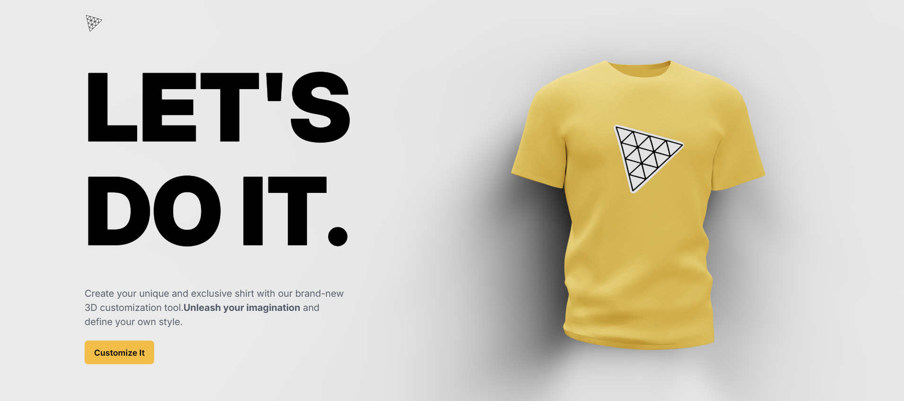
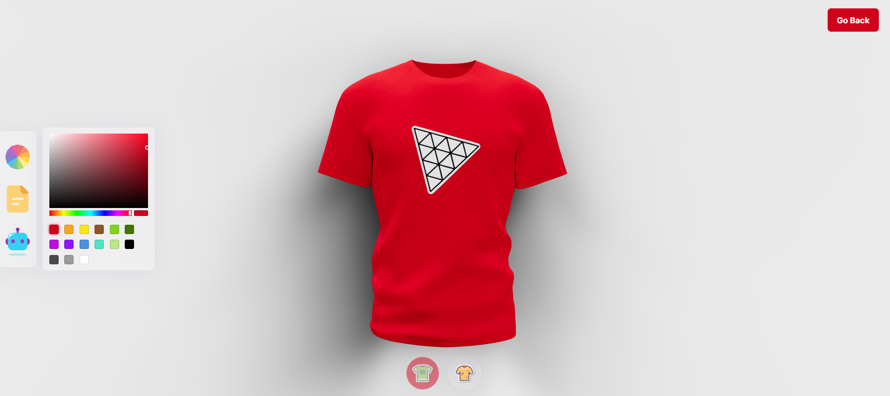

# Shirt_Designer

## Build and Deploy an AI-Powered 3D Website Using React

In this project, I used:
- **ThreeJS**: A powerful 3D graphics library for rendering and animating the 3D model.
- **React Three Fiber**: A popular library for creating 3D graphics with ThreeJS in React.
- **TailwindCSS**: A popular utility-first CSS styling framework.
- **Framer Motion**: The most popular library used to bring your React website to life with animation.
- **OpenAI API**: Used OpenAI API key to design the shirt using Artificial Intelligence.

## Features
1. **Change Color of the Shirt**: Use color palettes to change the color of the shirt.
2. **Upload Customized Logo**: Upload a custom logo and place it on the shirt.
3. **AI-Powered Design**: Change color and design, including the logo, by giving instructions to the AI.
4. **Download the Designed T-Shirt**: Download the final design of the t-shirt.

## Demo Link
[Live Website Link](https://3dshirtdesigner.fun/)
